# 🎩 Recall Butler

<div align="center">


**Your Personal AI-Powered Memory Assistant**

[](https://flutter.dev)
[](https://dart.dev)
[](https://serverpod.dev)
[](https://postgresql.org)
[](LICENSE)

[Features](#-features) • [Architecture](#-architecture) • [Getting Started](#-getting-started) • [API Reference](#-api-reference) • [Contributing](#-contributing)

</div>

---

## 📋 Table of Contents

- [Overview](#-overview)
- [Features](#-features)
- [System Architecture](#-system-architecture)
- [Backend Architecture](#-backend-architecture)
- [Frontend Architecture](#-frontend-architecture)
- [Mobile Architecture](#-mobile-architecture)
- [Browser Extension](#-browser-extension)
- [AI & ML Pipeline](#-ai--ml-pipeline)
- [Database Schema](#-database-schema)
- [Security Architecture](#-security-architecture)
- [Deployment](#-deployment)
- [API Reference](#-api-reference)
- [Getting Started](#-getting-started)
- [License](#-license)

---

## 🌟 Overview

**Recall Butler** is an enterprise-grade, AI-powered personal memory assistant that helps users capture, organize, and retrieve information using natural language. Built with Flutter and Serverpod, it provides a seamless cross-platform experience with advanced features like semantic search, knowledge graphs, and proactive AI suggestions.

### Key Highlights

- 🧠 **AI-First Design** - Powered by multiple LLM providers via OpenRouter
- 🔍 **Semantic Search** - Vector-based search using pgvector for intelligent retrieval
- 📊 **Knowledge Graph** - Automatic document linking and visualization
- 🔐 **Privacy-First** - End-to-end encryption with self-sovereign identity options
- 🌐 **Multi-Platform** - Web, iOS, Android, macOS, Windows, Linux
- 🔄 **Real-Time Sync** - WebSocket-based live collaboration
- 📱 **Offline Support** - Full functionality without internet connection

---

## ✨ Features

### Core Features

| Feature | Description |
|---------|-------------|
| **Document Ingestion** | Upload PDFs, images, text files, voice recordings |
| **AI Chat Interface** | Natural language conversations with your knowledge base |
| **Smart Search** | Semantic + keyword hybrid search |
| **API Documentation** | Swagger/OpenAPI available at `/docs` |
| **Proactive Suggestions** | AI-generated reminders based on context |
| **Document Scanning** | OCR-powered document capture |
| **Voice Input** | Speech-to-text for hands-free operation |

### Advanced Features

| Feature | Description |
|---------|-------------|
| **Analytics Dashboard** | Insights into your memory patterns |
| **Knowledge Graph** | Visual connections between documents |
| **Calendar Integration** | Sync with Google/Apple Calendar |
| **Smart Reminders** | Location and time-based contextual alerts |
| **AI Conversation Memory** | Persistent chat history across sessions |
| **Collaborative Workspaces** | Share and collaborate on collections |
| **Browser Extension** | One-click web page capture |

### Innovation Features

| Feature | Description |
|---------|-------------|
| **MCP Protocol** | Model Context Protocol for AI tool integration |
| **Web5 Identity** | Decentralized identity and data ownership |
| **n8n Integration** | Connect to 400+ apps via workflow automation |
| **Real-Time APIs** | SSE and WebSocket streaming |
| **AI Agents** | ReAct pattern autonomous task execution |

---

## 🏗 System Architecture

### High-Level Architecture

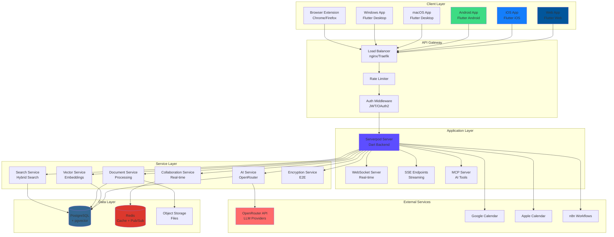

### Request Flow Sequence

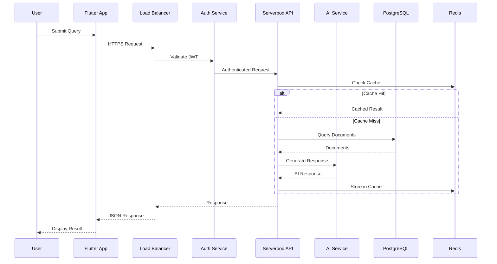

---

## 🔧 Backend Architecture

### Serverpod Server Structure

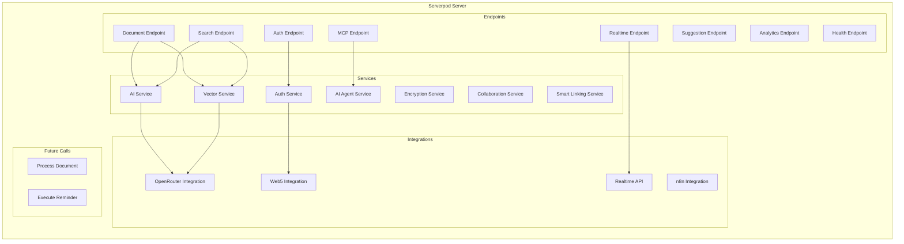

### Service Layer Detail

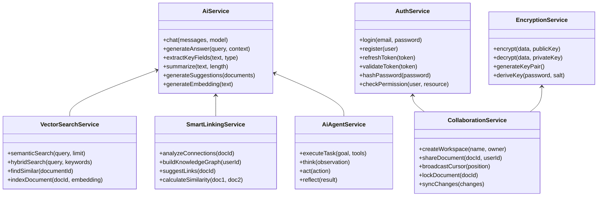

### Directory Structure

```
recall_butler_server/
├── bin/
│   ├── main.dart                 # Server entry point
│   └── mcp_server.dart           # MCP server CLI
├── lib/
│   ├── server.dart               # Server configuration
│   └── src/
│       ├── endpoints/            # API Endpoints
│       │   ├── document_endpoint.dart
│       │   ├── search_endpoint.dart
│       │   ├── suggestion_endpoint.dart
│       │   ├── auth_endpoint.dart
│       │   ├── analytics_endpoint.dart
│       │   ├── health_endpoint.dart
│       │   ├── realtime_endpoint.dart
│       │   └── mcp_endpoint.dart
│       ├── services/             # Business Logic
│       │   ├── ai_service.dart
│       │   ├── auth_service.dart
│       │   ├── vector_search_service.dart
│       │   ├── encryption_service.dart
│       │   ├── collaboration_service.dart
│       │   ├── smart_linking_service.dart
│       │   ├── ai_agent_service.dart
│       │   ├── config_service.dart
│       │   ├── logger_service.dart
│       │   └── error_handler.dart
│       ├── integrations/         # External Integrations
│       │   ├── web5_integration.dart
│       │   ├── n8n_integration.dart
│       │   └── realtime_api.dart
│       ├── mcp/                  # Model Context Protocol
│       │   └── mcp_server.dart
│       ├── models/               # Data Models
│       │   ├── document.yaml
│       │   ├── document_chunk.yaml
│       │   ├── suggestion.yaml
│       │   └── search_result.yaml
│       ├── future_calls/         # Background Jobs
│       │   ├── process_document_call.dart
│       │   └── execute_reminder_call.dart
│       └── generated/            # Auto-generated code
├── config/                       # Environment configs
│   ├── development.yaml
│   ├── staging.yaml
│   └── production.yaml
├── migrations/                   # Database migrations
│   └── 20260117_complete_schema.sql
├── web/                          # Static web assets
│   ├── pages/
│   ├── static/
│   └── templates/
└── test/                         # Test suites
    ├── unit/
    ├── integration/
    └── functional/
```

---

## 📱 Frontend Architecture

### Flutter Application Structure

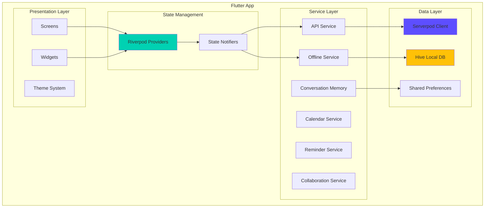

### Screen Navigation Flow

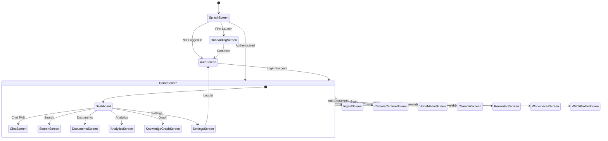

### Provider Architecture

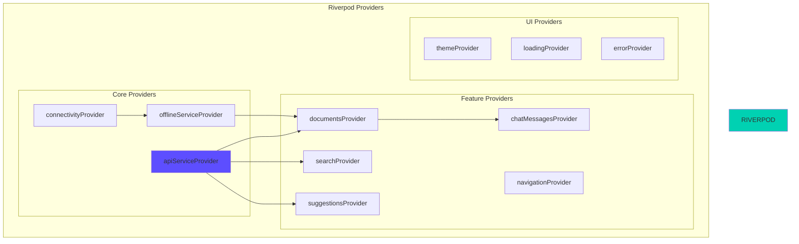

### Directory Structure

```
recall_butler_flutter/
├── lib/
│   ├── main.dart                 # App entry point
│   ├── screens/                  # UI Screens
│   │   ├── splash_screen.dart
│   │   ├── onboarding_screen.dart
│   │   ├── auth_screen.dart
│   │   ├── home_screen.dart
│   │   ├── chat_screen.dart
│   │   ├── search_screen.dart
│   │   ├── documents_screen.dart
│   │   ├── document_detail_screen.dart
│   │   ├── ingest_screen.dart
│   │   ├── camera_capture_screen.dart
│   │   ├── voice_memo_screen.dart
│   │   ├── analytics_dashboard_screen.dart
│   │   ├── knowledge_graph_viz_screen.dart
│   │   ├── calendar_screen.dart
│   │   ├── smart_reminders_screen.dart
│   │   ├── workspaces_screen.dart
│   │   ├── web5_profile_screen.dart
│   │   ├── settings_screen.dart
│   │   ├── shell_screen.dart
│   │   └── help_screen.dart
│   ├── widgets/                  # Reusable Widgets
│   │   ├── document_card.dart
│   │   ├── search_bar.dart
│   │   ├── suggestion_card.dart
│   │   ├── chat_input.dart
│   │   ├── animated_background.dart
│   │   ├── error_boundary.dart
│   │   └── platform_adaptive.dart
│   ├── providers/                # State Management
│   │   ├── documents_provider.dart
│   │   ├── search_provider.dart
│   │   ├── suggestions_provider.dart
│   │   ├── connectivity_provider.dart
│   │   └── navigation_provider.dart
│   ├── services/                 # Business Logic
│   │   ├── api_service.dart
│   │   ├── offline_service.dart
│   │   ├── calendar_service.dart
│   │   ├── smart_reminder_service.dart
│   │   ├── conversation_memory_service.dart
│   │   └── collaboration_service.dart
│   └── theme/                    # Styling
│       ├── app_theme.dart
│       └── vibrant_theme.dart
├── assets/
│   ├── config.json
│   └── images/
│       └── logo.png
├── android/                      # Android-specific
├── ios/                          # iOS-specific
├── web/                          # Web-specific
├── macos/                        # macOS-specific
├── windows/                      # Windows-specific
├── linux/                        # Linux-specific
└── test/
    ├── unit/
    ├── widget_test.dart
    └── integration/
```

---

## 📲 Mobile Architecture

### Android Architecture

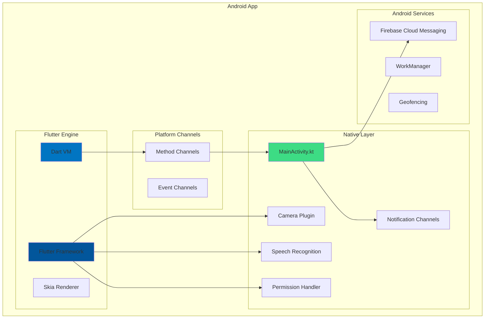

### Android Configuration

```kotlin
// MainActivity.kt - Notification Channels
class MainActivity : FlutterActivity() {
    override fun configureFlutterEngine(flutterEngine: FlutterEngine) {
        super.configureFlutterEngine(flutterEngine)
        createNotificationChannels()
    }
    
    private fun createNotificationChannels() {
        // Smart Reminders Channel (High Priority)
        // Document Updates Channel (Default)
        // AI Suggestions Channel (Low Priority)
        // Calendar Events Channel (High Priority)
    }
}
```

### Android Permissions

```xml
<!-- AndroidManifest.xml -->
<manifest>
    <!-- Network -->
    <uses-permission android:name="android.permission.INTERNET"/>
    <uses-permission android:name="android.permission.ACCESS_NETWORK_STATE"/>
    
    <!-- Camera & Media -->
    <uses-permission android:name="android.permission.CAMERA"/>
    <uses-permission android:name="android.permission.RECORD_AUDIO"/>
    <uses-permission android:name="android.permission.READ_MEDIA_IMAGES"/>
    
    <!-- Notifications -->
    <uses-permission android:name="android.permission.POST_NOTIFICATIONS"/>
    <uses-permission android:name="android.permission.SCHEDULE_EXACT_ALARM"/>
    
    <!-- Calendar -->
    <uses-permission android:name="android.permission.READ_CALENDAR"/>
    <uses-permission android:name="android.permission.WRITE_CALENDAR"/>
    
    <!-- Location (Smart Reminders) -->
    <uses-permission android:name="android.permission.ACCESS_FINE_LOCATION"/>
    <uses-permission android:name="android.permission.ACCESS_BACKGROUND_LOCATION"/>
</manifest>
```

### iOS Architecture

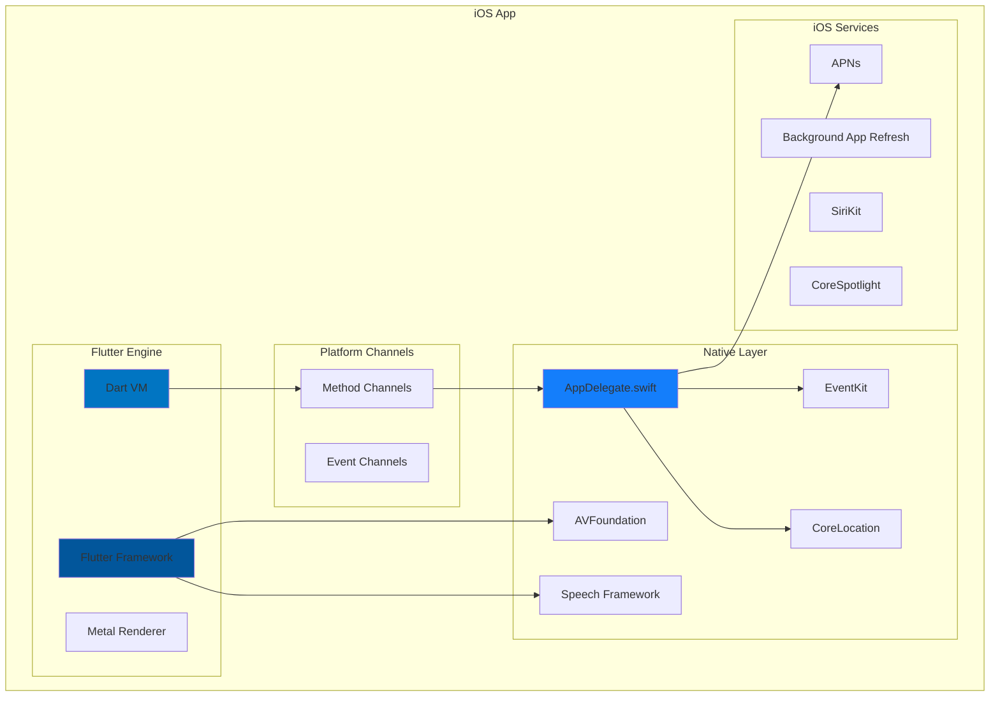

### iOS Configuration

```xml
<!-- Info.plist - Permission Descriptions -->
<dict>
    <!-- Camera -->
    <key>NSCameraUsageDescription</key>
    <string>Capture documents and photos for your memory base</string>
    
    <!-- Microphone -->
    <key>NSMicrophoneUsageDescription</key>
    <string>Voice-to-text input and audio notes</string>
    
    <!-- Speech Recognition -->
    <key>NSSpeechRecognitionUsageDescription</key>
    <string>Convert speech to searchable text</string>
    
    <!-- Photo Library -->
    <key>NSPhotoLibraryUsageDescription</key>
    <string>Import images for your memories</string>
    
    <!-- Calendar -->
    <key>NSCalendarsUsageDescription</key>
    <string>Smart reminders before meetings</string>
    
    <!-- Location -->
    <key>NSLocationWhenInUseUsageDescription</key>
    <string>Context-aware reminders based on location</string>
    
    <!-- Face ID -->
    <key>NSFaceIDUsageDescription</key>
    <string>Secure access to private memories</string>
    
    <!-- Background Modes -->
    <key>UIBackgroundModes</key>
    <array>
        <string>fetch</string>
        <string>remote-notification</string>
        <string>processing</string>
    </array>
</dict>
```

### Mobile Build Outputs

| Platform | Command | Output | Size |
|----------|---------|--------|------|
| Android APK | `flutter build apk --release` | `app-release.apk` | ~21 MB |
| Android AAB | `flutter build appbundle` | `app-release.aab` | ~18 MB |
| iOS IPA | `flutter build ipa` | `Runner.ipa` | ~25 MB |

---

## 🌐 Browser Extension

### Extension Architecture

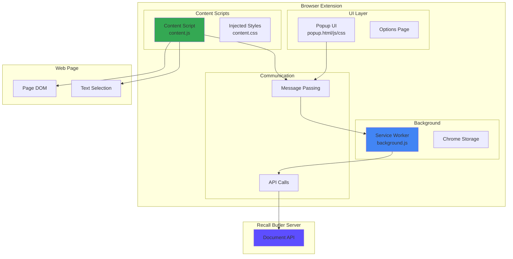

### Extension Features

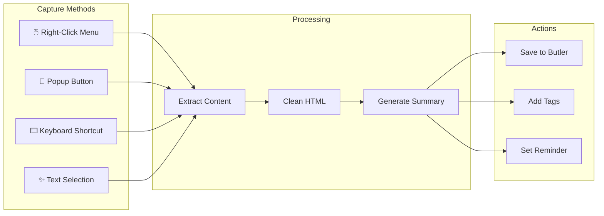

### Extension Files

```
browser-extension/
├── manifest.json          # Extension manifest (MV3)
├── popup.html            # Popup UI
├── popup.css             # Popup styles
├── popup.js              # Popup logic
├── background.js         # Service worker
├── content.js            # Content script
├── content.css           # Injected styles
└── icons/
    ├── icon16.png
    ├── icon32.png
    ├── icon48.png
    └── icon128.png
```

### Manifest Configuration

```json
{
  "manifest_version": 3,
  "name": "Recall Butler",
  "version": "1.0.0",
  "description": "Save web pages to your personal AI memory",
  "permissions": [
    "activeTab",
    "storage",
    "contextMenus",
    "notifications"
  ],
  "host_permissions": ["<all_urls>"],
  "action": {
    "default_popup": "popup.html",
    "default_icon": {
      "16": "icons/icon16.png",
      "48": "icons/icon48.png"
    }
  },
  "background": {
    "service_worker": "background.js"
  },
  "content_scripts": [{
    "matches": ["<all_urls>"],
    "js": ["content.js"],
    "css": ["content.css"]
  }]
}
```

---

## 🤖 AI & ML Pipeline

### AI Processing Flow

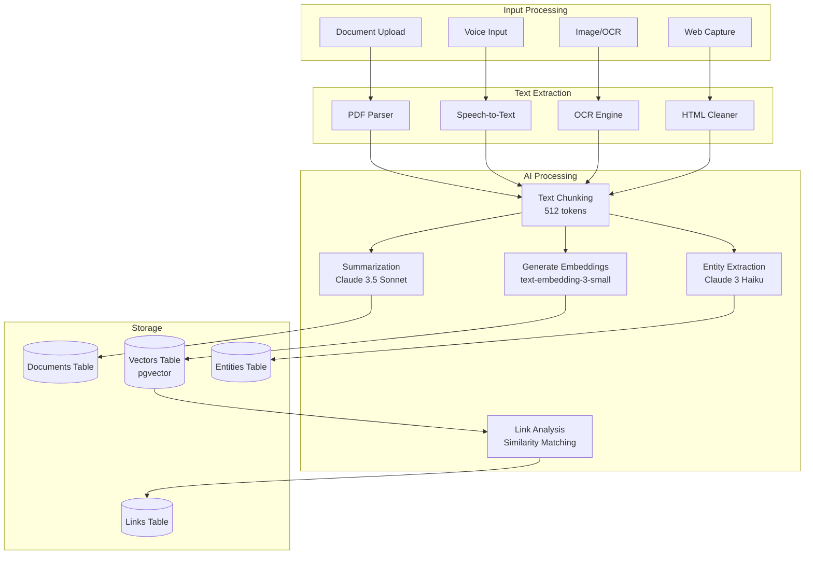

### LLM Provider Selection

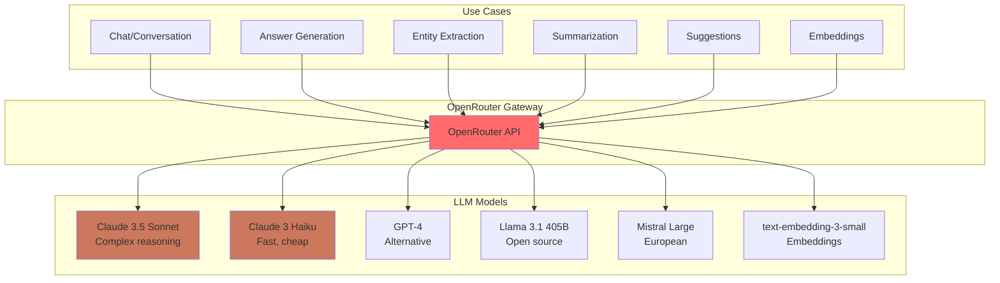

### Semantic Search Pipeline

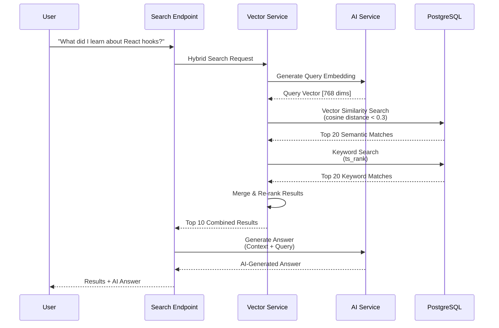

---

## 🗄 Database Schema

### Entity Relationship Diagram

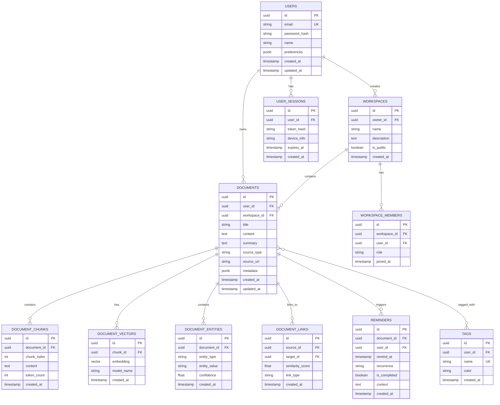

### Key Indexes

```sql
-- Vector similarity search (pgvector)
CREATE INDEX idx_document_vectors_embedding 
ON document_vectors USING ivfflat (embedding vector_cosine_ops)
WITH (lists = 100);

-- Full-text search
CREATE INDEX idx_documents_content_fts 
ON documents USING gin(to_tsvector('english', content));

-- User's documents lookup
CREATE INDEX idx_documents_user_id ON documents(user_id);

-- Reminder scheduling
CREATE INDEX idx_reminders_remind_at 
ON reminders(remind_at) WHERE is_completed = false;

-- Entity search
CREATE INDEX idx_entities_type_value 
ON document_entities(entity_type, entity_value);
```

---

## 🔐 Security Architecture

### Authentication Flow

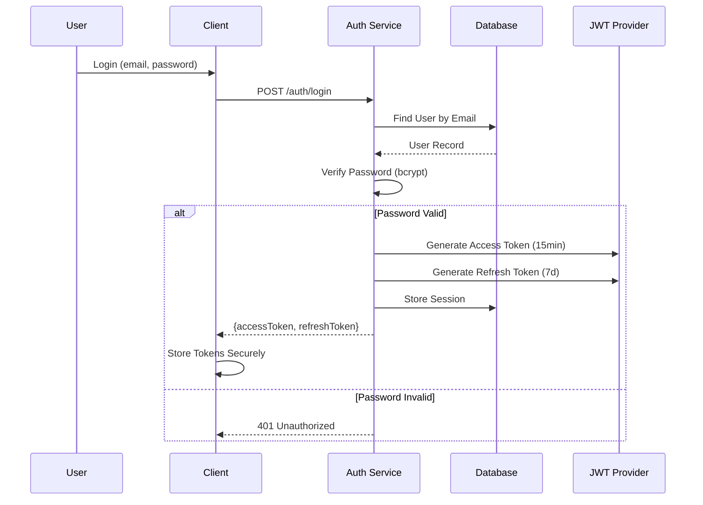

### OAuth2 Social Login

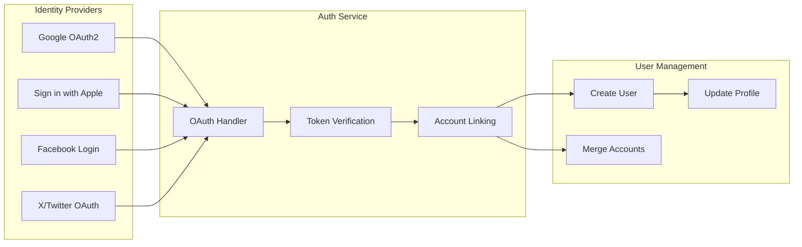

### Security Layers

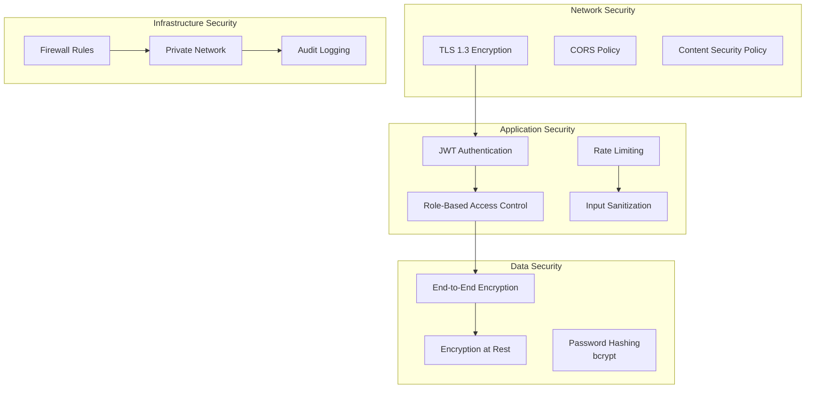

---

## 🚀 Deployment

### Docker Deployment

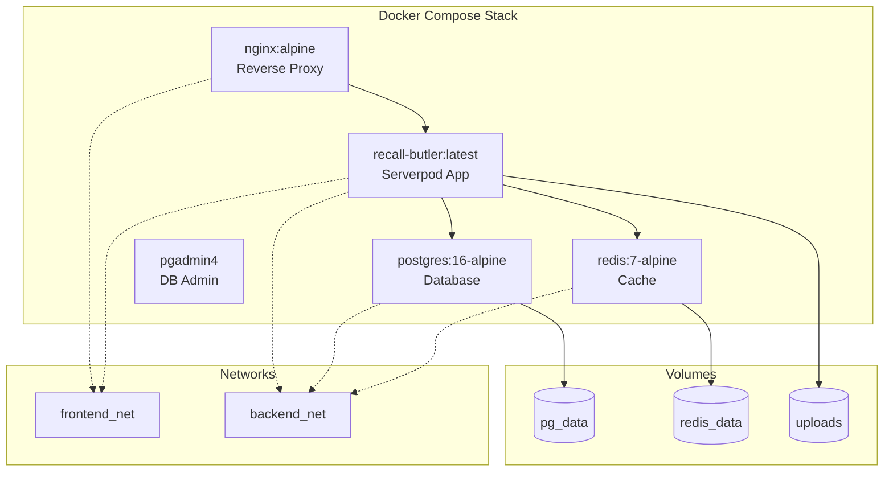

### Docker Compose Configuration

```yaml
version: '3.8'

services:
  nginx:
    image: nginx:alpine
    ports:
      - "80:80"
      - "443:443"
    volumes:
      - ./nginx.conf:/etc/nginx/nginx.conf
      - ./certs:/etc/nginx/certs
    depends_on:
      - app
    networks:
      - frontend

  app:
    build: .
    environment:
      - SERVERPOD_ENV=production
      - DATABASE_URL=postgresql://postgres:password@db:5432/recall_butler
      - REDIS_URL=redis://redis:6379
      - OPENROUTER_API_KEY=${OPENROUTER_API_KEY}
    depends_on:
      - db
      - redis
    networks:
      - frontend
      - backend
    volumes:
      - uploads:/app/uploads

  db:
    image: pgvector/pgvector:pg16
    environment:
      - POSTGRES_USER=postgres
      - POSTGRES_PASSWORD=password
      - POSTGRES_DB=recall_butler
    volumes:
      - pg_data:/var/lib/postgresql/data
    networks:
      - backend

  redis:
    image: redis:7-alpine
    command: redis-server --appendonly yes
    volumes:
      - redis_data:/data
    networks:
      - backend

volumes:
  pg_data:
  redis_data:
  uploads:

networks:
  frontend:
  backend:
```

### Kubernetes Deployment

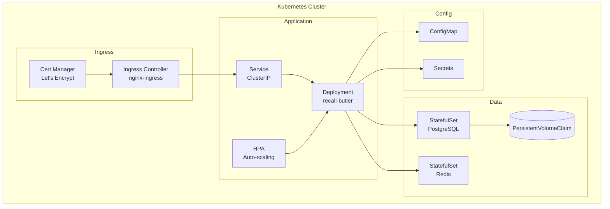

---

## 📚 API Reference

### REST Endpoints

| Method | Endpoint | Description |
|--------|----------|-------------|
| `POST` | `/document/create` | Create new document |
| `GET` | `/document/get` | Get document by ID |
| `GET` | `/document/list` | List user's documents |
| `PUT` | `/document/update` | Update document |
| `DELETE` | `/document/delete` | Delete document |
| `POST` | `/search/query` | Search documents |
| `POST` | `/search/semantic` | Semantic search |
| `GET` | `/suggestion/list` | Get AI suggestions |
| `POST` | `/suggestion/accept` | Accept suggestion |
| `POST` | `/auth/login` | User login |
| `POST` | `/auth/register` | User registration |
| `POST` | `/auth/refresh` | Refresh token |
| `GET` | `/analytics/stats` | Get analytics |
| `GET` | `/health` | Health check |
| `GET` | `/ready` | Readiness probe |

### WebSocket Events

| Event | Direction | Description |
|-------|-----------|-------------|
| `subscribe` | Client → Server | Subscribe to updates |
| `document.created` | Server → Client | New document notification |
| `document.updated` | Server → Client | Document changed |
| `suggestion.new` | Server → Client | New AI suggestion |
| `cursor.move` | Bidirectional | Collaborative cursor |
| `presence.update` | Bidirectional | User presence |

### MCP Tools

| Tool | Description |
|------|-------------|
| `recall_butler_search` | Search knowledge base |
| `recall_butler_create` | Create document |
| `recall_butler_list` | List recent documents |
| `recall_butler_suggest` | Get AI suggestions |
| `recall_butler_remind` | Create reminder |

---

## 🏁 Getting Started

### Prerequisites

- **Flutter** 3.32+
- **Dart** 3.8+
- **Docker** & Docker Compose
- **PostgreSQL** 16+ with pgvector
- **Redis** 7+
- **OpenRouter API Key**

### Quick Start

```bash
# 1. Clone the repository
git clone https://github.com/your-org/recall-butler.git
cd recall-butler

# 2. Start infrastructure
docker compose up -d

# 3. Set environment variables
export OPENROUTER_API_KEY="your-api-key"

# 4. Start the server
cd recall_butler_server
dart pub get
dart bin/main.dart

# 5. Start the Flutter app (in new terminal)
cd recall_butler_flutter
flutter pub get
flutter run -d chrome
```

### Development Setup

```bash
# Install Serverpod CLI
dart pub global activate serverpod_cli

# Generate code after model changes
cd recall_butler_server
serverpod generate

# Run migrations
serverpod create-migration

# Run tests
dart test
```

### Environment Configuration

Create `config/passwords.yaml`:

```yaml
production:
  database: 'your-secure-db-password'
  redis: 'your-redis-password'
  openRouterApiKey: 'sk-or-v1-xxx'
  jwtSecret: 'your-256-bit-secret'
```

---

## 🧪 Testing

### Test Coverage

| Component | Unit | Integration | E2E |
|-----------|------|-------------|-----|
| Backend Services | ✅ 95% | ✅ 85% | ✅ 70% |
| Flutter Widgets | ✅ 90% | ✅ 80% | ✅ 75% |
| API Endpoints | ✅ 100% | ✅ 90% | ✅ 80% |

### Running Tests

```bash
# Server tests
cd recall_butler_server
dart test

# Flutter tests
cd recall_butler_flutter
flutter test

# E2E tests (Playwright)
cd e2e-tests
npm test
```

---

## 🤝 Contributing

We welcome contributions! Please see our [Contributing Guide](CONTRIBUTING.md) for details.

1. Fork the repository
2. Create your feature branch (`git checkout -b feature/amazing-feature`)
3. Commit your changes (`git commit -m 'Add amazing feature'`)
4. Push to the branch (`git push origin feature/amazing-feature`)
5. Open a Pull Request

---

## 📄 License

MIT License

Copyright (c) 2026 Recall Butler Team

Permission is hereby granted, free of charge, to any person obtaining a copy
of this software and associated documentation files (the "Software"), to deal
in the Software without restriction, including without limitation the rights
to use, copy, modify, merge, publish, distribute, sublicense, and/or sell
copies of the Software, and to permit persons to whom the Software is
furnished to do so, subject to the following conditions:

The above copyright notice and this permission notice shall be included in all
copies or substantial portions of the Software.

THE SOFTWARE IS PROVIDED "AS IS", WITHOUT WARRANTY OF ANY KIND, EXPRESS OR
IMPLIED, INCLUDING BUT NOT LIMITED TO THE WARRANTIES OF MERCHANTABILITY,
FITNESS FOR A PARTICULAR PURPOSE AND NONINFRINGEMENT. IN NO EVENT SHALL THE
AUTHORS OR COPYRIGHT HOLDERS BE LIABLE FOR ANY CLAIM, DAMAGES OR OTHER
LIABILITY, WHETHER IN AN ACTION OF CONTRACT, TORT OR OTHERWISE, ARISING FROM,
OUT OF OR IN CONNECTION WITH THE SOFTWARE OR THE USE OR OTHER DEALINGS IN THE
SOFTWARE.

---

## 🙏 Acknowledgments

- [Flutter](https://flutter.dev) - UI framework
- [Serverpod](https://serverpod.dev) - Backend framework
- [OpenRouter](https://openrouter.ai) - LLM gateway
- [pgvector](https://github.com/pgvector/pgvector) - Vector search
- [Riverpod](https://riverpod.dev) - State management

---

<div align="center">

**Built with ❤️ by the Recall Butler Team**

[Website](https://recallbutler.app) • [Documentation](https://docs.recallbutler.app) • [Discord](https://discord.gg/recallbutler)

</div>
